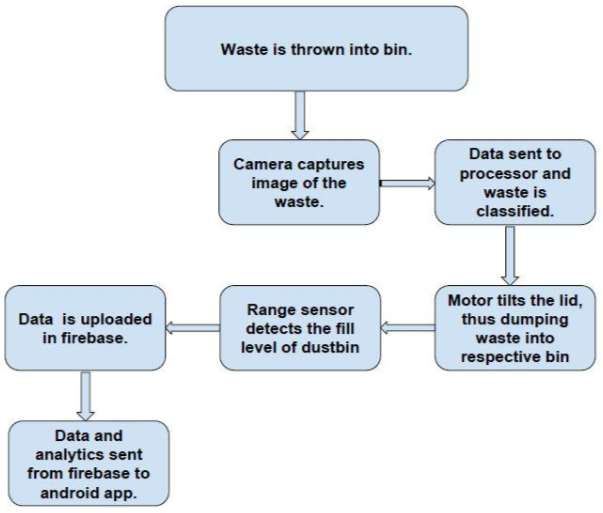

 

 
 

This COVID19 Map was built with [Create React App](https://github.com/facebook/create-react-app) for our [website](https://surakshacovid19.tech). If you wish to use this map dont forget to credit our developers.

## Available Scripts

In the project directory, you can run:

### `npm start` or `npm i && npm start`

Runs the app in the development mode. 
Open [http://localhost:3000](http://localhost:3000) to view it in the browser.

The page will reload if you make edits. 
You will also see any lint errors in the console.

### `npm test`

Launches the test runner in the interactive watch mode. 
See the section about [running tests](https://facebook.github.io/create-react-app/docs/running-tests) for more information.

### `npm run build`

Builds the app for production to the `build` folder. 
It correctly bundles React in production mode and optimizes the build for the best performance.

The build is minified and the filenames include the hashes. 
Your app is ready to be deployed!

See the section about [deployment](https://facebook.github.io/create-react-app/docs/deployment) for more information.

### `npm run eject`

**Note: this is a one-way operation. Once you `eject`, you can’t go back!**

If you aren’t satisfied with the build tool and configuration choices, you can `eject` at any time. This command will remove the single build dependency from your project.

Instead, it will copy all the configuration files and the transitive dependencies (webpack, Babel, ESLint, etc) right into your project so you have full control over them. All of the commands except `eject` will still work, but they will point to the copied scripts so you can tweak them. At this point you’re on your own.

You don’t have to ever use `eject`. The curated feature set is suitable for small and middle deployments, and you shouldn’t feel obligated to use this feature. However we understand that this tool wouldn’t be useful if you couldn’t customize it when you are ready for it.

# TrashIt!
 "*Segregation of biodegradable and non-biodegradable waste using ML and IoT, all integrated in a garbage bin*" - with my team under [Team Envision at Aaruush, SRM IST](https://aaruush.net/callforaaruush/envision.html). (Prototype phase)

**Objective:**  
To efficiently automate the segregation of waste based on its type, i.e. biodegradable or not, in order to ensure proper waste disposal for healthier environment.

**Introduction:**  
TrashIt! is a waste management and disposal solution which is our eager initiative in order to ensure a cleaner and greener campus. It employs technology of Machine learning, IOT and an android app (frontend) to provide an easy waste disposal solution and show real time analytics for each trash bin nearby an area.  
TrashIt! Is a smart can which can classify biodegradable and non-biodegradable waste on it own and place that waste in different bins. The data collected during the trashing process is synchronized with an app interface to show relevant details of each dustbin and thereby sending a notification to the authorities whenever it gets filled.

**Methodology:**  

**Need for the project:**  
Intelligent classification for recycling and disposal of waste around the university campus. It also depicts SRM's initiative towards Swachh Bharat Abhiyan.

**Implementation strategy:**
Our smart trash bin could be placed in various places around the campus. Java, UB, Tech Park canteens would be our prime targets.  
In the near future, we could also make a larger model which could manage massive amounts of waste generated by SRM mess everyday. Food waste could be dealt with at a large scale in the future. 

**Pros:**  
-Waste is classified as per its type.
-Manpower is reduced;the waste need not be sorted by a person.
-Fuel is saved.The content in each bin is analyzed and based on that, the call for transportation is made.  
**Cons:**  
-The model is costlier than a normal plastic dustbin.
-Mixed waste cannot be classified efficiently upto a certain extent.
-In order to classify the waste efficiently, the waste should be scanned in ample lighting conditions.

**Remember to update the iot files with api and auth key.**

**To train the image classifier with your own model**
1)git clone https://github.com/googlecodelabs/tensorflow-for-poets-2

2)cd tensorflow-for-poets-2

3)Place all your jpg or png images category folders in tf-files/Dataset

4)Go to the folder tensorflow for poets using cmd and paste either of the mobinet or inception (any of the first two codes) in the cmd

5)After couple of hours to minutes depending on the pc, the model is trained.

6)Get some testing images and place it in tf-files and make a folder named test.

7)Now paste either of last two commands from my script.txt file in git depending on mobinet or inception training model you used.
**Remember to update the last part of the testing command to the directory where your training data images are saved**

**To use my pretrained garbage image classifier with your own images**

1)Clone the current repository.

2)Repeat step 2 , 6 and 7

Any issues or queries mail me at shubhayan1998@gmail.com
